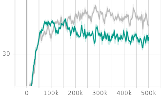

# RND_for_RestMin_v1
Solving RestMin_v1 with  Random-Network-Distillation, in the framework of Stable Baseline 3.

> Random Network Distillation (RND) is a technique used in the field of reinforcement learning that focuses on exploration in unknown environments. RND utilizes a randomly initialized neural network called the "exploration network" to generate a pseudo-count for states visited by the agent during training. This pseudo-count is then used as an intrinsic reward signal to encourage the agent to explore regions of the state space that are less visited.
>
> Compared to other exploration strategies, such as epsilon-greedy or softmax exploration, RND has several benefits, including its simplicity and scalability. Additionally, because RND does not require any information about the task at hand, it can be easily applied to many different types of reinforcement learning problems. Overall, Random Network Distillation has proven to be a highly effective method for improving the exploration capabilities of reinforcement learning agents.

理想情况下，将 RestMin_v1 视作一个稀疏奖励的探索问题，除了最优解能获得正的奖励值，其余皆为0。因此，RND提供的内在奖励将完全主导决策过程。
值得注意的是，由于RND总是会给予稀有状态更高的奖励分，所以总会出现“反复横跳”的现象（探索 or 开采？RND倾向前者）。
所以想仅依靠RND，是无法实现100%最优解的。 

## Size=5, Mode=0
仓库 [here](https://github.com/wwsyan/RND_for_RestMin_v1/tree/main/size5_mode0), 
运行文件 [here](https://github.com/wwsyan/RND_for_RestMin_v1/blob/main/size5_mode0/run.py).

| Episode length | Episode reward |
| :---: | :---: |
||

## Size=6, Mode=0
### n_steps: 1024 VS 2048
| 幕长 | 幕奖励 | 信息 | 结论 |
| :---: | :---: | :---: | :---: |
|||橙：1024, 蓝：2048| 1024 更优 |
### RND: 观测向量 标准化 VS 不标准化
| 幕长 | 幕奖励 | 说明 | 结论 |
| :---: | :---: | :---: | :---: |
|||红：non-norm, 蓝：norm| norm 更优 |
### reward: 单一惩罚 VS 阶梯惩罚
在上述实验中，外部奖励只能通过达成最优解得到，即：<code>reward = 100 if count == 1 else 0</code>。
从结果上看，效果并不理想。虽然agent能够探索到最优解，但一旦探索到了最优解，就会导致前期某些重要的动作出现频率增加。
由于RND的机制，这些动作的内在奖励反而减少，导致了agent不能持续获取高收益。
这体现了在 Exploration 与 Exploitation 的权衡中，RND是一种倾向于 Exploration 的算法。

在接下来的实验中，将尝试添加额外的环境奖励（惩罚）以获得更好的平均分：
<ul>
  <li>奖励1：<code>if count > 3: reward = -100</code></li>
  <li>奖励2：<code>if count > 3: reward = -5*count</code></li>
</ul>
这么设计的想法是希望通过惩罚分“淹没”内在奖励，来保证一些重要的前期动作能顺利执行。
在前期动作全部正确选择后，将由内在奖励完全引导决策过程，因为只有最优解才能获得正的奖励值（+100），其余次优解奖励皆为0。

| 幕长 | 幕奖励 | 说明 | 结论 |
| :---: | :---: | :---: | :---: |
|||灰：奖励2, 绿：奖励1| 奖励2更优 |

阶梯式的奖励变化效果更好，应该是优势函数发挥了作用，使得agent总能依据当前自身发展状况做出选择。

## Size=6, Mode=1
在这个模式中，由于合法动作的大量增加，探索的难度也大大提升了。另外，由于两个异色子可以无限横跳，所以环境中加了最大50步的限制。
### 基线: PPO
使用标准的PPO作为基准，需要对环境作出一些修改，使之不是奖励稀疏的环境：
<code>reward = 100 if count == 2 else 5*(6-count)</code>

| 幕长 | 幕奖励 | 说明 | 结论 |
| :---: | :---: | :---: | :---: |
||| 蓝：0-2M步，红：2M-4M步 | 在测试环境中运行，未发现能探索到最优解 |

### RND
| 幕长 | 幕奖励 | 说明 | 结论 |
| :---: | :---: | :---: | :---: |
||| step=80k时出现了正的平均分，说明探索到了最优解 | 能探索到最优解，但无法开采 |

